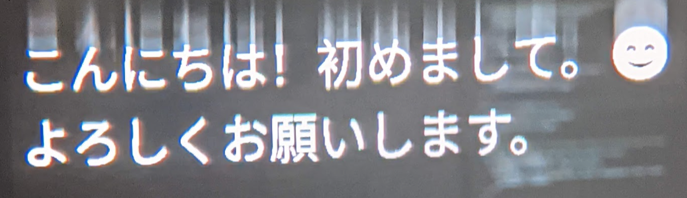
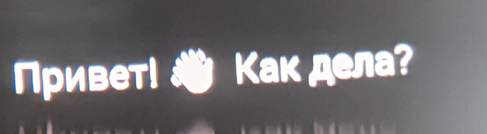
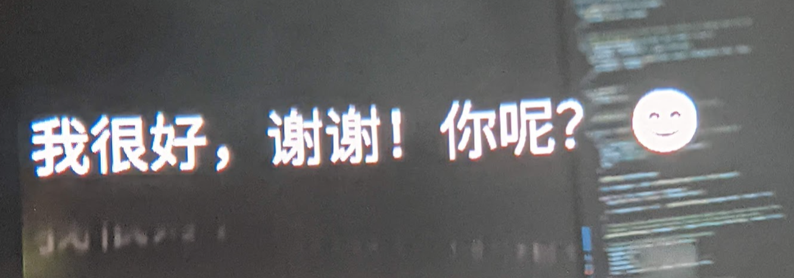
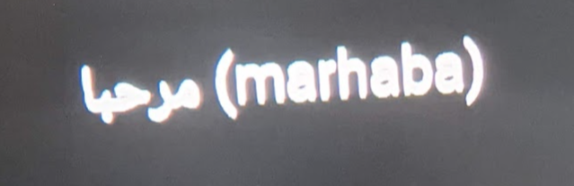
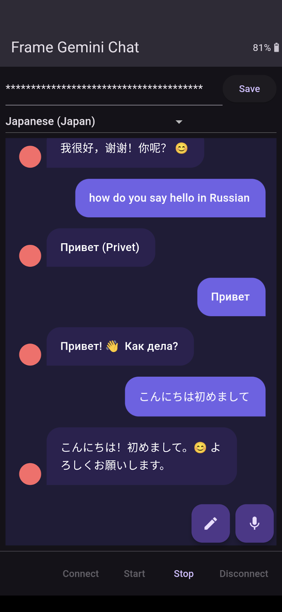

# Frame Gemini Chat

Speak to a Gemini AI model by voice using platform-provided speech-to-text, and show response text in any language on the Brilliant Labs Frame display. Unicode and right-to-left script is supported. Uses `flutter_chat_ui` package for chat UI.

Demonstrates `TxTextSpriteBlock` message that performs phoneside text rendering to image, sent as `TxSprite`s for display.

Speech-to-text capabilities are device-dependent, and the platform may provide entirely on-device or cloud-based transcription.

Gemini chat is provided through the Google Gemini API, and API keys are free (with registration): [See here](https://ai.google.dev/gemini-api/docs/api-key). Add your API key in the text box at the top of the screen and "Save".
Please note, API queries using free keys can be used for training Google's models, but queries using paid keys should not.

## Frameshots

## Screenshots

### Architecture

